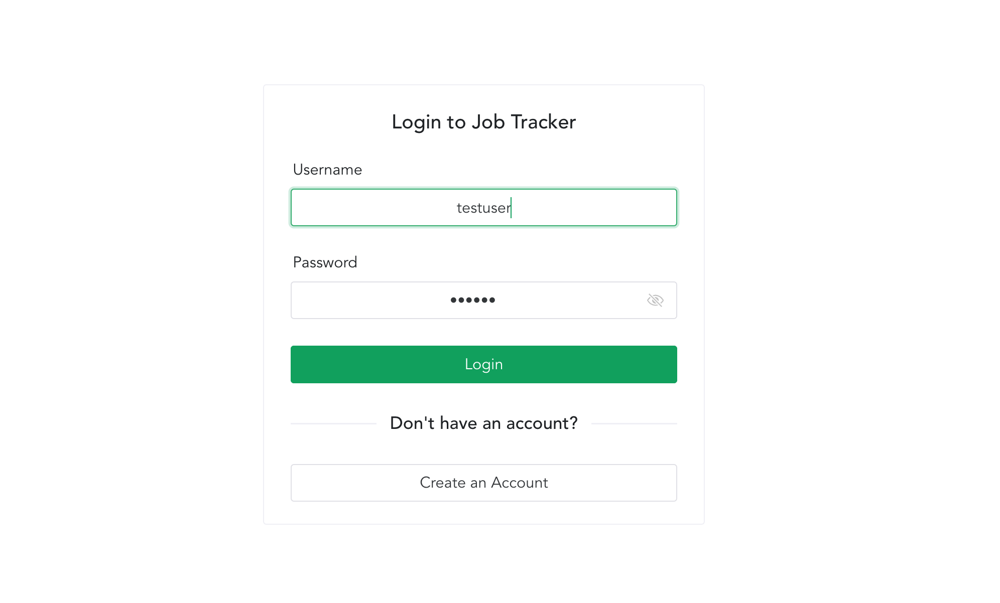
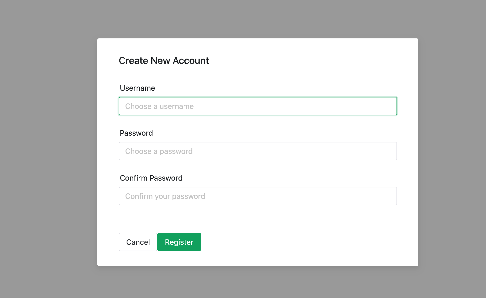
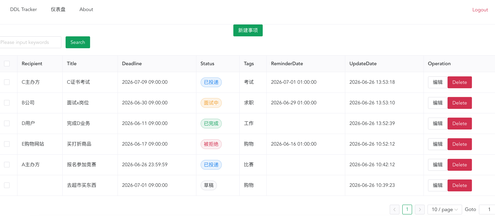

# Job Tracker

这是一个用于跟踪和管理个人求职申请记录的全栈 Web 应用程序。前端使用 Vue.js 构建，后端使用 Java Spring Boot 实现，并由 Nginx 进行部署。

This is a full-stack web application for tracking and managing personal job application records. The front-end is built with Vue.js, the back-end is implemented using Java Spring Boot, and it is deployed with Nginx.

## 主要界面

### 登录和注册页面

这是此项目的用户登录界面和注册新用户界面。

### 主页面

这是此项目的主界面。

## 主要功能

- **用户认证与授权系统 (JWT)**:
  - 用户注册: 提供开放的注册接口，新用户密码在后端通过 BCrypt 算法进行安全哈希加密后存储。
  - 用户登录: 采用基于 JWT (JSON Web Token) 的无状态认证机制。用户凭证验证成功后，服务器会签发一个有时效性的 JWT 令牌。
  - 持久化登录: 前端将 JWT 存储在 `localStorage` 中，即使用户关闭或刷新浏览器，也能保持登录状态，提升了用户体验。
  - API 认证: 所有受保护的 API 请求都会在请求头中携带 JWT (`Authorization: Bearer <token>`)。后端通过一个自定义的 Spring Security Filter 来拦截和验证每个请求的令牌。
  - 路由保护: 使用 Vue Router 全局导航守卫 (`beforeEach`) 实现前端路由级别的权限控制，未登录用户访问受保护页面会自动重定向到登录页。
  - 登出功能: 提供安全的登出路径，清除前端存储的认证信息并重定向。
- **工作记录管理 (CRUD)**:
  - 创建 (Create) 新的求职记录。
  - 读取 (Read) 所有求职记录。
  - 更新 (Update) 已有的求职记录。
  - 删除 (Delete) 单条记录。
  - 批量删除(Batch Delete): 支持多选并批量删除工作记录。
- **分页**: 对工作列表进行服务器端分页，提升大数据量下的性能。
- **模糊搜索**: 根据关键词在多个字段（如公司、职位、标签）中进行筛选。

## TODO

-[x]注册功能
-[]权限管理
-[]前端优化
-[]一键把所有记录导出为 CSV 文件或其他格式

## 技术栈

- **前端**:
  - Vue 3 (Composition API, `<script setup>`)
  - Vue Router
  - Naive UI (UI 组件库)
  - Axios (HTTP 请求库)
  - 构建工具: Vue CLI / Webpack

- **后端**:
  - Java (JDK 17+)
  - Spring Boot
  - Spring Security (JWT 认证)
  - Spring Data JPA (Hibernate)
  - 数据库: MySQL

- **容器化**:
  Docker & Docker Compose (实现环境一致性与一键部署)
- **部署**:
  - Nginx (作为静态文件服务器和 API 网关/反向代理)

## 快速开始 (Docker 一键部署)

只要你的机器安装了 Docker 和 Docker Compose，即可快速运行本项目。

1.**克隆项目**

git clone https://github.com/ari-0210/job-tracker-fullstack.git
cd job-tracker-fullstack

2.**配置环境变量**

复制 .env.example 并更名为 .env，根据需要修改数据库密码和 JWT 密钥。

3.**启动应用**

docker-compose up -d --build

4.**访问应用**

前端界面: http://localhost:8888
后端 API: http://localhost:8080

### Nginx 部署架构说明

本项目采用 Nginx 反向代理方案。在 Docker 环境下，Nginx 容器会自动处理：

**前端路由**: 自动映射 / 到静态资源，并支持 SPA 路由回退 (try_files)。

**API 转发**: 自动将所有 /api/ 开头的请求转发至后端容器 backend:8080。

**无需手动配置:** 相关的 nginx.conf 已集成在 docker 文件夹中，启动即生效。
