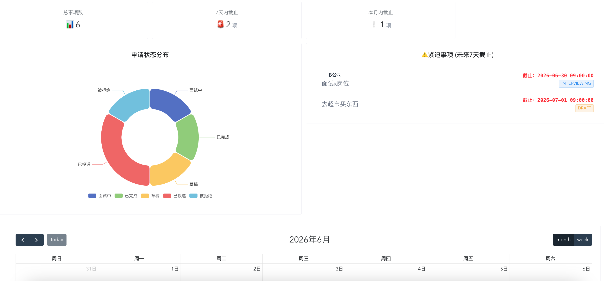
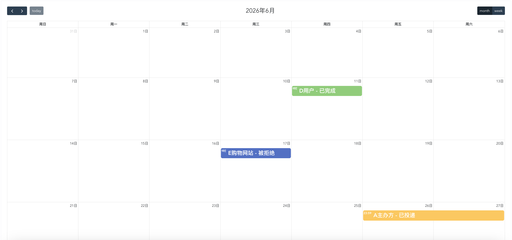

# DDL Tracker

该项目是一个**RESTful 架构** 的全栈一体化事项Deadline(截止日期) 追踪管理平台。针对生活多场景中“事项状态难同步、截止日期易遗漏、文件归类混乱”的痛点，构建了包含事项状态跟踪、截止日期提醒、简历附件关联及多维数据看板的全栈系统。。系统采用前后端分离架构，引入 Redis 旁路缓存机制与 Spring Security 权限框架，利用 Docker-Compose 与 Nginx 实现云端静态资源分离与高可用集成部署。

---

## 云端实时演示

项目已成功部署至阿里云服务器，欢迎点击下方链接免注册直接登录体验：

- **⚡ 在线演示平台**： [http://47.110.124.30:8888/#/]
- **🔑 演示凭证**： 账号 `TestUser` | 密码 `123456`

---

## 核心视觉界面

### 核心业务流程 (Login & CRUD)

具备严丝合缝的登录防线与流式管理列表，支持响应式多选批量删除与服务器端分页。

### 多维数据看板 (Dashboard) & 日历轨迹

基于 ECharts 与 Naive UI 构建响应式看板，实现投递状态分布、周/月度投递频率、Offer 对比的实时渲染；日历组件支持多定时事件动态轨迹标记。

## 主界面主要功能

- **用户认证与授权系统 (JWT)**:
  - 用户注册: 提供开放的注册接口，新用户密码在后端通过 BCrypt 算法进行安全哈希加密后存储。
  - 用户登录: 采用基于 JWT (JSON Web Token) 的无状态认证机制。用户凭证验证成功后，服务器会签发一个有时效性的 JWT 令牌。
  - 持久化登录: 前端将 JWT 存储在 `localStorage` 中，即使用户关闭或刷新浏览器，也能保持登录状态，提升了用户体验。
  - API 认证: 所有受保护的 API 请求都会在请求头中携带 JWT (`Authorization: Bearer <token>`)。后端通过一个自定义的 Spring Security Filter 来拦截和验证每个请求的令牌。
  - 路由保护: 使用 Vue Router 全局导航守卫 (`beforeEach`) 实现前端路由级别的权限控制，未登录用户访问受保护页面会自动重定向到登录页。
  - 登出功能: 提供安全的登出路径，清除前端存储的认证信息并重定向。
- **工作记录管理 (CRUD)**:
  - 创建 (Create) 新的求职记录。
  - 读取 (Read) 所有求职记录。
  - 更新 (Update) 已有的求职记录。
  - 删除 (Delete) 单条记录。
  - 批量删除(Batch Delete): 支持多选并批量删除工作记录。
- **分页**: 对工作列表进行服务器端分页，提升大数据量下的性能。
- **模糊搜索**: 根据关键词在多个字段（如公司、职位、标签）中进行筛选。

---

## 核心架构与工程亮点

** 数据可视化看板与时区防腐**：
利用 MySQL 聚合函数（`COUNT`, `GROUP BY`）实现多维度统计渲染；独立实现日历视图组件，通过**后端 Jackson 前置时区序列化（GMT+8）**，彻底根治了 Docker 容器默认 UTC 时区导致的云端时间标记错位 8 小时问题。
** 高频统计二级缓存设计 (Redis)**：
针对 Dashboard 统计高频查询、低频更新特性，采用 **Cache Aside（旁路缓存）** 模式，设置 30 分钟逻辑过期；配合 `@Transactional` 事务，在写操作中实施“先更新数据库，再精准清除对应缓存”策略，**降低 70% 数据库聚合查询压力**，并确保最终一致性。
** 纵向越权纵深防御 (BOLA)**：
拒绝前端传参信任，通过 `SecurityContextHolder` 结合 JWT 签名解密，在**后端动态盲取当前登录的 userId**；针对文件下载/删除、事项修改实施宿主校验，在 SQL 与业务逻辑双重层面强制匹配资源所有权，杜绝越权篡改漏洞。
** 入参防腐与全局异常熔断**：
解耦数据实体与传输模型，引入 JobDTO 规避敏感属性篡改（Mass Assignment）风险。使用 `@Valid` 进行入参强校验，并配置 **`@RestControllerAdvice` + `Result<T>`** 统一封装全局异常，隐藏底层底层 SQL 堆栈信息（StackTrace）防范安全隐患。
** 容器化运维与静态资源分离**：
编写 Dockerfile 与 Docker Compose 脚本，实现全栈组件一键式编排与多环境隔离（dev/prod）；**通过宿主机 Docker Volume 挂载隔离简历附件**，配合 Nginx `location /uploads` 实施静态资源定向直服，避免大文件下载榨干 JVM 内存。

---

## 🛠️ 技术栈全景

### 前端生态

- **核心框架**：Vue 3 (Composition API, `<script setup>`)
- **构建工具**：Vite / TypeScript (TS)
- **状态管理**：Pinia
- **路由管理**：Vue Router (全局导航守卫拦截)
- **UI 框架**：Naive UI / Tailwind CSS (现代原子化样式隔离)
- **网络请求**：Axios (支持请求/响应拦截器统一注入 Token)

### 后端架构

- **核心框架**：Spring Boot 3.x / Java (JDK 17)
- **安全框架**：Spring Security + JWT (无状态认证机制)
- **持久层**：Spring Data JPA (Hibernate 驱动)
- **文档规范**：Knife4j (Swagger 3 零手工交互式 API 文档)

### 中间件与运维

- **数据库**：MySQL 8.0
- **缓存组件**：Redis 7.0 (Alpine 极简镜像)
- **反向代理**：Nginx (高性能静态文件托管与 API 代理网关)

---

## 🏁 快速开始 (Docker 一键编排)

只要你的机器安装了 Docker 和 Docker Compose，即可在本地 15 秒内快速建立完全体运行环境。

### 1. 准备工作

1.**克隆项目并进入根目录**

git clone [https://github.com/ari-0210/job-tracker-fullstack.git] 2.**配置环境密匙**
复制环境模板并更名为 .env，根据需要修改数据库密码和 JWT 密钥：
cp .env.example .env 3.**一键启动**
运行以下命令，Docker Compose 会自动拉起 MySQL、Redis、后端、前端，并完成 Nginx 反向代理绑定：

docker-compose up -d --build 4. **服务入口**
前端大门 (Nginx 托管): http://localhost:8888

后端交互文档 (Knife4j): http://localhost:8080/doc.html

## Nginx 反向代理与物理挂载架构

本项目在容器内部对 Nginx 进行了工业级升级改造：

location /：托管前端打包产物（dist），利用 try_files 规避 SPA 刷新 404 问题。

location /api/：反向代理自动将前端请求无缝穿透转发至后端容器 backend:8080/。

location /uploads/：物理存储防腐拦截。容器挂载 ./uploads 卷后，用户上传的简历附件由 Nginx 直接在内核态高效直服，彻底将静态资源大文件流从 Java 应用中解耦出来。

## TODO 路线图

[x] 用户注册与 BCrypt 加密存储

[x] 基于 JWT 的持久化登录与安全注销

[x] 统计大屏看板 (ECharts) 与响应式布局

[x] 基于 Docker Volume 挂载的文件上传系统

[x] Redis 两级缓存优化与多维度越权防御

[ ] 前端性能微调与首屏加载深度优化

## [ ] 一键将所有追踪记录异步导出为 CSV / Excel 报表
