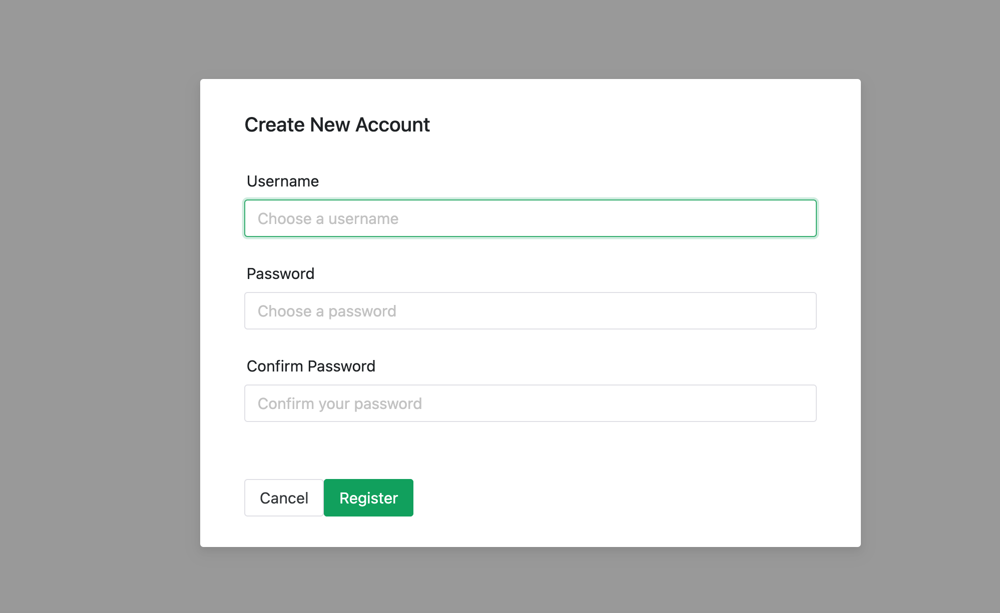

# Job Tracker

这是一个用于跟踪和管理个人求职申请记录的全栈 Web 应用程序。前端使用 Vue.js 构建，后端使用 Java Spring Boot 实现，并由 Nginx 进行部署。

This is a full-stack web application for tracking and managing personal job application records. The front-end is built with Vue.js, the back-end is implemented using Java Spring Boot, and it is deployed with Nginx.

## 主要界面

### 登录和注册页面

这是此项目的用户登录界面和注册新用户界面。



### 主页面

这是此项目的主界面。


## 主要功能

- **用户认证与授权系统 (JWT)**:
  - 用户注册: 提供开放的注册接口，新用户密码在后端通过 BCrypt 算法进行安全哈希加密后存储。
  - 用户登录: 采用基于 JWT (JSON Web Token) 的无状态认证机制。用户凭证验证成功后，服务器会签发一个有时效性的 JWT 令牌。
  - 持久化登录: 前端将 JWT 存储在 `localStorage` 中，即使用户关闭或刷新浏览器，也能保持登录状态，提升了用户体验。
  - API 认证: 所有受保护的 API 请求都会在请求头中携带 JWT (`Authorization: Bearer <token>`)。后端通过一个自定义的 Spring Security Filter 来拦截和验证每个请求的令牌。
  - 路由保护: 使用 Vue Router 全局导航守卫 (`beforeEach`) 实现前端路由级别的权限控制，未登录用户访问受保护页面会自动重定向到登录页。
  - 登出功能: 提供安全的登出路径，清除前端存储的认证信息并重定向。
- **工作记录管理 (CRUD)**:
  - 创建 (Create) 新的求职记录。
  - 读取 (Read) 所有求职记录。
  - 更新 (Update) 已有的求职记录。
  - 删除 (Delete) 单条记录。
  - 批量删除(Batch Delete): 支持多选并批量删除工作记录。
- **分页**: 对工作列表进行服务器端分页，提升大数据量下的性能。
- **模糊搜索**: 根据关键词在多个字段（如公司、职位、标签）中进行筛选。

## 技术栈

- **前端**:

  - Vue 3 (Composition API, `<script setup>`)
  - Vue Router
  - Naive UI (UI 组件库)
  - Axios (HTTP 请求库)
  - 构建工具: Vue CLI / Webpack

- **后端**:

  - Java (JDK 17+)
  - Spring Boot
  - Spring Security (JWT 认证)
  - Spring Data JPA (Hibernate)
  - 数据库: MySQL

- **部署**:
  - Nginx (作为静态文件服务器和 API 网关/反向代理)

## 快速开始

### 环境准备

在运行此项目之前，请确保你的系统上已安装以下软件：

- Node.js (v16 或更高版本) 和 npm/yarn
- JDK (Java Development Kit, v17 或更高版本)
- Maven 或 Gradle
- MySQL Server
- Nginx
- Postman (推荐，用于 API 测试)

### 后端设置

1.  **克隆项目**：

    ```bash
    git clone ‘https://github.com/ari-0210/job-tracker-fullstack.git'
    ```

2.  **数据库配置**：

    - 在 MySQL 中创建一个数据库。
    - 修改 `src/main/resources/application.properties` 文件，更新数据库连接信息：

      ```properties
      spring.datasource.url=jdbc:mysql://localhost:3306/你的数据库名
      spring.datasource.username=你的数据库用户名
      spring.datasource.password=你的数据库密码

      # 推荐的 JPA/Hibernate 配置
      spring.jpa.hibernate.ddl-auto=update # 开发时使用 update，生产环境建议使用 validate 或 none
      spring.jpa.show-sql=true
      logging.level.org.hibernate.SQL=DEBUG
      logging.level.org.hibernate.type.descriptor.sql=TRACE
      ```

3.  **JWT 配置**：

    - 在 `application.properties` 中设置 JWT 密钥和过期时间：
      ```properties
      jwt.secret=这是一个必须超过32字节的足够长且安全的密钥字符串请务必修改
      jwt.expiration.ms=86400000 # 24小时 (单位：毫秒)
      ```

4.  **启动后端**：
    - 在你的 IDE (如 IntelliJ IDEA) 中直接运行主应用类。
    - 或者使用 Maven/Gradle 在项目根目录下运行：`./mvnw spring-boot:run` 或 `./gradlew bootRun`。
    - 后端服务默认应运行在 `http://localhost:8080` (或其他你配置的端口)。

### 前端设置

1.  **安装依赖**：

    - 进入前端项目目录 (例如 `cd your-frontend-folder`)。
    - 运行 `npm install` 或 `yarn install`。

2.  **开发模式运行 (用于开发)**：

    - 为了让开发服务器的 API 请求能正确访问后端，需要在 `vue.config.js` 中配置 `devServer.proxy`。
      ```javascript
      // vue.config.js
      module.exports = {
        devServer: {
          proxy: {
            "/api": {
              target: "http://localhost:8080", // 指向你的后端服务地址
              changeOrigin: true,
            },
          },
        },
      };
      ```
    - 配置好代理后，运行 `npm run serve`。
    - 前端开发服务器将运行在（例如）`http://localhost:5173`。

3.  **构建生产版本 (用于部署)**：
    - 运行 `npm run build`。
    - 这会在项目下生成一个 `dist` 文件夹，里面是所有用于部署的静态文件。

### Nginx 部署

1.  **复制文件**：将前端 `dist` 目录下的所有文件复制到你的 Nginx 服务器的某个目录（例如 `/var/www/job-tracker`）。

2.  **配置 Nginx**：

    - 在 Nginx 的配置目录（例如 `/usr/local/etc/nginx/servers/` 或 `/etc/nginx/sites-available/`）下创建一个新的配置文件，例如 `job-tracker.conf`。
    - 填入以下配置内容（请根据你的实际路径和端口修改）：

      ```nginx
      server {
          listen       8888; # 前端访问的端口
          server_name  localhost;

          # 前端静态文件的根目录
          root /path/to/your/dist/folder; # 修改为你的 dist 文件夹的绝对路径
          index  index.html;

          # 处理前端 SPA 路由
          location / {
              try_files $uri $uri/ /index.html;
          }

          # 将所有 /api 请求反向代理到后端 Spring Boot 服务
          location /api/ {
              proxy_pass http://localhost:8080; # 修改为你的后端服务地址和端口
              proxy_set_header Host $host;
              proxy_set_header X-Real-IP $remote_addr;
              proxy_set_header X-Forwarded-For $proxy_add_x_forwarded_for;
              proxy_set_header X-Forwarded-Proto $scheme;
          }

          error_page   500 502 503 504  /50x.html;
          location = /50x.html {
              root   html;
          }
      }
      ```

3.  **重载 Nginx**：
    - 检查配置是否有语法错误：`sudo nginx -t`
    - 使配置生效：`sudo nginx -s reload`

## 使用说明

1.  **创建用户**：访问 Nginx 服务的地址（例如 `http://localhost:8888`），点击注册，输入用户名和密码进行创建用户。
2.  **登录**：访问 Nginx 服务的地址。如果未登录，应用会自动跳转到登录页面。输入用户名和密码进行登录。
3.  **主界面**：登录成功后，即可看到工作列表。可以进行创建、更新、删除、批量删除、分页和搜索等操作。
